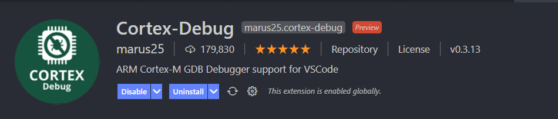

# iMX 7ULP Exploration for Wearable Ultrasound Sensor

This project is conducted for the SoCDaML course exmanitation as a miniproject.

Using the NXP iMX 7 ULP devkit, we evaluate the feasibility, performance and power consumption of a wearable ultrasound sensor with a power consumption under 1 Watt.

## Project planification

[Gantt chart](https://view.monday.com/1453663162-e9185251b7c593d24864bfbab5e83f3e?r=use1)

## Installation and setup

DISCLAIMER: the setup has been tested on Windows.

The vendor (NXP) does not provide a SDK compatible with MCUXpresso IDE. To debug/flash the IMX7 Cortex-M4 processor without having to go through the tedious process of using u-boot to flash the image through QSPI, we prepared a tailored custom toolchain. Users don't need to copy the image on the SD Card to run their program but rather can use J-LINK.

[Firstly, follow the procedure given by NXP to install armgcc](https://github.com/NXPmicro/mcux-sdk/blob/main/docs/run_a_project_using_armgcc.md)

Then, the user should install [Visual Studio Code](https://code.visualstudio.com/) (latest version) and the Cortex Debug extension on VSCode. 

Open the preferences in VSCode (or use <kbd>CTRL</kbd> + <kbd>SHIFT</kbd> + <kbd>P</kbd> and type pref), and append the following code. Modify accordingly to match your local installation.

```json
    "cortex-debug.JLinkGDBServerPath": "C:\\Program Files (x86)\\SEGGER\\JLink\\JLinkGDBServerCL.exe",
    "cortex-debug.armToolchainPath": "C:\\Program Files (x86)\\GNU Arm Embedded Toolchain\\10 2020-q4-major\\bin"
```

### VSCode workspace

|         File         |              Description             |
|:--------------------:|:------------------------------------:|
|  .vscode/tasks.json  |      VSCode tasks configuration      |
| .vsccode/launch.json | Cortex-Debug extension configuration |

Tasks and launch configurations have already been written and don't require modifications.

The keyboard shortcut to run tasks is <kbd>CTRL</kbd> + <kbd>SHIFT</kbd> + <kbd>B</kbd>. Three options are available:

- Build STM32 FW (output in stm32nucleo/spi/build)
- Build IMX7 Cortex-M4 FW (output in src/armgcc/debug)
- Flash STM32 FW (requires a build)

### Execute code on IMX7 Cortex-M4 using JLINK

To succesfully attach the debugger on IMX7ULP-EVK, the DIP switches configuration must be as follow:

| DIP PIN | [0] | [1] | [2] | [3] |
|:-------:|:---:|:---:|:---:|:---:|
|  State  |  0  |  1  |  0  |  0  |

Connect the JTAG 20 pin connector on the EVK to JLINK. Power the JLink adapter. Use the build IMX7 task to compile the software, and then press F5 to run IMX7ULP Cortex-M4 Debug configuration.

### Execute code on STM32-Nucleo-MB1136 using STLINK (on-board debugger)

Connect the STM32 board through USB. Build the STM32 FW using the task provided in the VS Workspace. Press F5 and run STM32 Cortex-M4 DEbug configuration. 

## Documentation

Extra material - https://polybox.ethz.ch/index.php/s/w6mQHlhTulI3gcB
[NXP Quick start guide (online)](https://www.nxp.com/document/guide/get-started-with-the-mcimx7ulp-evk:GS-MCIMX7ULP-EVK) 

[Gitlab (online)](https://iis-git.ee.ethz.ch/gthivolet/imx7ulp-exploration)

## Contact

Author is Guillaume Thivolet (guillaume@glabs.ch) 
Responsible PhD student:  Sergei Vostrikov (vsergei@iis.ee.ethz.ch)
